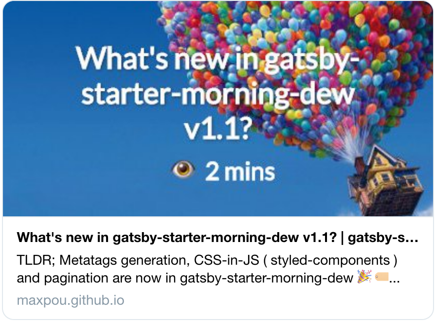
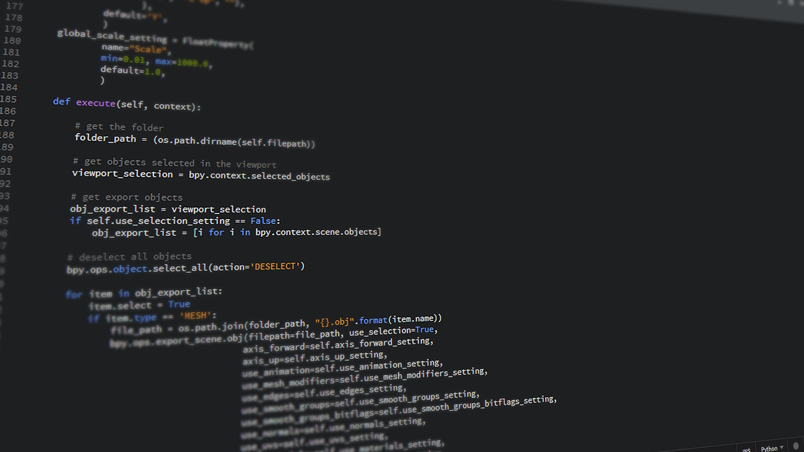

**첫번 째 포스트** 

테스트



**How to do it?**

1. In a terminal, run `npm run dev`.
2. In a second terminal, run: `npm run generatePostPreviewImages`
3. In the post's header, add the generated images:
  ```yaml
  title: My blog post
  # ...
  imageTw: ./gatsby-starter-morning-dew-v1-1-tw.png
  imageFb: ./gatsby-starter-morning-dew-v1-1-fb.png
  ```
테스트
